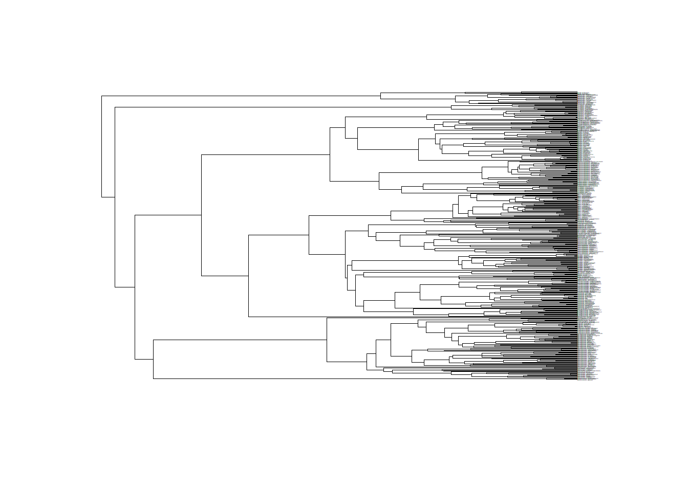

## Required Data

Generating LTST plots requires information on ancestral geographic states obtained from ancestral state estimation analysis using BioGeoBEARs. Once users have performed a BioGeoBEARS analysis, have selected a model of best-fit, and generated biogeographic stochastic maps from this model and its parameters, users should have the four objects necessary to continue.

First load the required packages


```r
library(BioGeoBEARS)
library(phytools)
library(reshape2)
library(ggplot2)
library(stringr)
library(devtools)
library(RColorBrewer)
```


Now install ltstR from the github repository


```r
devtools::install_github(repo = "alexskeels/ltstR")
```

```
## Skipping install of 'ltstR' from a github remote, the SHA1 (9298d125) has not changed since last install.
##   Use `force = TRUE` to force installation
```

```r
library(ltstR)


# users can query the different functions to get a description of what they
# do. e.g.,

`?`(getEventTiming)
```

```
## starting httpd help server ...
```

```
##  done
```

```r
`?`(getRangeState)
```


```r
# users can alternatively load the R functions from the appendix

path <- "C:/path/to/appendix/directory"
setwd(path)

functions <- list("getLTSTDataTable.R","getLTSTFromStochasticMaps.R","getRangeState.R","LTST_vignette.html","slidingWindowForStochasticMaps.R","timeRangeAcrossStochasticMaps.R","getEventTiming.R", "correctNodeHeights.R")

lapply(functions, source)
```


For further information on each function or to get the code to modify these functions users can find the commented code in the R folder on the gitub page: 
www.github.com/alexskeels/ltstR

The ltstR package comes with the data necessary to create LTST plots for the agamid lizards.


```r
# first load the data
data(Agamidae)
```

```r
# or alternatively from the appenidx
setwd(path)
load("Agamidae.RData")
```

```r
# view the objects

ls()
```

```
## [1] "AET"       "CET"       "tipranges" "tr"
```

```r
# can have a look at the different objects

# tr is the phylogeny
# tipranges is the BioGeoBEARs geography object
# CET is the cladogenetic events table
# AET is the anagenetic events table

# the phylogeny
plot(tr, cex=0.1,  edge.width = 0.6)
```



```r
# the geographic data
# W, I, P, and A are all single letter variable names associated with four biogeographic realms: 
# W = Wallacea/Australasia
# I = Indomalaya
# P = Palearctic
# A = Afrotropics
head(tipranges@df)
```

```
##                         W A P I
## Hydrosaurus_weberi      1 0 0 0
## Hydrosaurus_pustulatus  0 0 0 1
## Hydrosaurus_amboinensis 1 0 0 1
## Hypsilurus_papuensis    1 0 0 0
## Hypsilurus_bruijnii     1 0 0 0
## Hypsilurus_nigrigularis 1 0 0 0
```

```r
# the cladogenetic events table list(CET)
class(CET)
```

```
## [1] "list"
```

```r
class(CET[[1]])
```

```
## [1] "data.frame"
```

```r
head(CET[[1]][1:10])
```

```
##   node ord_ndname node_lvl node.type parent_br edge.length ancestor
## 1    1          1        6       tip         1    3.120884      426
## 2    2          2        6       tip         2    3.120884      426
## 3    3          3        5       tip       272    7.397286      425
## 4    4          4       11       tip       437   16.649613      433
## 5    5          5       12       tip       273   12.804597      434
## 6    6          6       13       tip         3   11.809053      435
##   daughter_nds  node_ht     time_bp
## 1              113.3192 3.90000e-05
## 2              113.3192 3.90000e-05
## 3              113.3192 3.90000e-05
## 4              113.3192 5.04270e-05
## 5              113.3192 5.04290e-05
## 6              113.3192 4.90214e-05
```

```r
# the anagenetic events table list(CET)
class(AET)
```

```
## [1] "list"
```

```r
class(AET[[1]])
```

```
## [1] "data.frame"
```

```r
head(AET[[1]][1:10])
```

```
##     node ord_ndname node_lvl node.type parent_br edge.length ancestor
## 3      3          3        5       tip       272    7.397286      425
## 93    93         93       12       tip       721   30.650273      522
## 96    96         96       16       tip        64    7.829888      526
## 99    99         99       17       tip       307   13.279947      529
## 107  107        107       17       tip       461   10.650706      538
## 124  124        124       18       tip       316    3.111069      551
##     daughter_nds  node_ht     time_bp
## 3                113.3192 3.90000e-05
## 93               113.3192 6.77341e-05
## 96               113.3192 5.75121e-05
## 99               113.3192 5.80816e-05
## 107              113.3192 5.75131e-05
## 124              113.3192 5.68981e-05
```

# LTST plot from a single biogeographic stochastic map (BSM)

Firstly we will load data from a single BSM and transform it into an LTST data table that has time steps as rows, and regions as columns, with each region/time-step being populated by a value of species diversity. In other words, species diversity through time for each region.


```r
data(Agamidae)
# we encounter a bug when a tree has many nodes of the same height
# a temporrary workaround for this is to add small deviates onto the node heights in the CET and AET tables
CAET <- correctNodeHeights(CET,AET)
CET <- CAET[[1]]
AET <- CAET[[2]]

CET_1 <- CET[[1]]
AET_1 <- AET[[1]]

ETT <- getEventTiming(tr, CET_1, AET_1)
head(ETT)
```

```
##        time node event extant_sp 2 5 8 11 4 9 3 10 14 15
## 1 113.30668  421 clado         2 0 1 0  0 0 0 1  0  0  0
## 2 110.07622  422 clado         3 0 2 0  0 0 0 1  0  0  0
## 3 105.34743  423 clado         4 0 3 0  0 0 0 1  0  0  0
## 4 100.99796  424 clado         5 0 4 0  0 0 0 1  0  0  0
## 5  89.55123  514 clado         6 0 5 0  0 0 0 1  0  0  0
## 6  78.29362  515 clado         7 0 6 0  0 0 0 1  0  0  0
```

```r
# create lookup table for the names of every different state combination identifier in the data
range_states <- getRangeState(CET_1, AET_1, tipranges)

range_states
```

```
##    range states
## 1      W      2
## 2      I      5
## 3     WI      8
## 4     PI     11
## 5      P      4
## 6     AP      9
## 7      A      3
## 8     AI     10
## 9    WPI     14
## 10   API     15
```

```r
# reduce this to diversity information at each time step for each region
LTST_dt <- getLTSTDataTable(ETT, range_states)

# Now lets have a look at how the data looks now

head(LTST_dt)
```

```
##        time W I P A
## 1 113.30668 0 1 0 1
## 2 110.07622 0 2 0 1
## 3 105.34743 0 3 0 1
## 4 100.99796 0 4 0 1
## 5  89.55123 0 5 0 1
## 6  78.29362 0 6 0 1
```


Now we can plot the LTST. Using ggplot is the most versatile way to do this, but requires melting the data first using the reshape package. Some knowledge of ggplot will be helpful for creating these plots, however the following code should suffice.


```r
LTST_dt2 <- melt(LTST_dt, id.vars = 'time', variable.name = 'region')


ggplot(LTST_dt2, aes(time, value)) + 
  geom_line(aes(colour = region), size = 2, alpha = 0.7) + # size controls the line width # alpha controls the line transparency
  theme_minimal()+ # makes background simple white colour
  xlab("Time (myr)")+ # x axis label
  ylab("Species Diversity")+ # y axis label
  scale_x_reverse() # makes x axis go from largest values (oldest times) to smallest values (youngest times)
```


```r
# colours can also be selected from preexisting palettes, e.g.,

ggplot(LTST_dt2, aes(time, value, colour=region)) + 
  scale_color_brewer(palette="Dark2")+
  geom_line(aes(colour = region), size = 2, alpha=0.7 ) +
  theme_minimal()+
  xlab("Time (myr)")+
  ylab("Species Diversity")+
  scale_x_reverse() 
```


```r
# can also plot of the log scale as is typical for LTT plots

# first get rid of Inf values when taking log of 0
LTST_dt2$logValue <- log(LTST_dt2$value)
LTST_dt2$logValue[which(LTST_dt2$logValue == log(0))] <- 0 


ggplot(LTST_dt2, aes(time, logValue, colour=region)) + 
  scale_color_brewer(palette="Dark2")+
  geom_line(aes(colour = region), size = 2, alpha = 0.7) +
  theme_minimal()+
  xlab("Time (myr)")+
  ylab("log(Species Diversity)")+
  scale_x_reverse()
```


```r
# more details on colours in ggplot can be found here
# http://www.cookbook-r.com/Graphs/Colors_(ggplot2)/
```


# LTST from a list of BSMs

Alternatively, we can produce a LTST that accounts for uncertainty in the biogeographic estimation, by incorporating information from a number of different stochastic maps. In this case we have AET and CET objects that contain the results of 50 stochastic mapping simulations.


```r
class(CET)
```

```
## [1] "list"
```

```r
class(AET)
```

```
## [1] "list"
```

```r
length(CET)
```

```
## [1] 50
```

```r
length(AET)
```

```
## [1] 50
```

```r
# create a list of bLTT curve data as we did above for each single stochastic map
LTST_dt_list <- getLTSTFromStochasticMaps(tr, CET, AET, tipranges)

# can see that times between stochastic maps are not exactly the same
length(LTST_dt_list[[1]]$time)  
```

```
## [1] 517
```

```r
length(LTST_dt_list[[2]]$time)
```

```
## [1] 516
```

```r
head(LTST_dt_list[[1]]$time)  
```

```
## [1] 113.30668 110.07622 105.34743 100.99796  89.55123  78.29362
```

```r
head(LTST_dt_list[[2]]$time)
```

```
## [1] 113.31823 110.09506 105.34296 100.96914  89.55640  78.28889
```

```r
# We want to perform a moving window analysis to make each LTST data table comparable
# the function slidingWindowForStochasticMaps does this for a single LTST_df
# the first row, time 0, is the most recent sample in the phylogeny (usually the present day) 
# this will present the current diveristy of each region

# e.g., 
single_window <- slidingWindowForStochasticMaps(LTST_dt_list[[1]], window = 1)
head(single_window)
```

```
##   time  W   I   P  A
## 1    0 97 181 104 63
## 2    1 96 176  96 62
## 3    2 93 174  94 60
## 4    3 92 163  88 57
## 5    4 88 156  83 50
## 6    5 82 148  81 47
```

```r
# we therefore want to apply it over the list if LTST data tabes
# default window is 0.1

window_dt_list <- lapply(LTST_dt_list, slidingWindowForStochasticMaps, window= 1)

# finally to plot the range of vlaues from across stochastic maps we want ot first summarise them
# here we use the upper (97.5%) and lower (2.5%) quantiles
# melt = T presnet the output in a way that is useful for plotting with ggplot2

LTST_dt_quantiles <- timeRangeAcrossStochasticMaps(tr, window_dt_list, melt=T)

# plot range of data from stochastic mapping
ggplot(aes(x=time, ymin=lowerQ, ymax=upperQ, colour=region, fill=region), data=LTST_dt_quantiles)+ 
  geom_ribbon(alpha = 4/10)+
  theme_minimal()+
  xlab("Time (myr)")+
  ylab("Species Diversity")+
  scale_x_reverse()
```


```r
# and again on the log scale
# first however have to get rid of values which are -inf which results from taking log(0)
LTST_dt_quantiles$logU <- log(LTST_dt_quantiles$upperQ)
LTST_dt_quantiles$logL <- log(LTST_dt_quantiles$lowerQ)
LTST_dt_quantiles$logU[which(LTST_dt_quantiles$logU == log(0))] <- 0
LTST_dt_quantiles$logL[which(LTST_dt_quantiles$logL == log(0))] <- 0
#

ggplot(aes(x=time, ymin=logL, ymax=logU, colour=region, fill=region), data=LTST_dt_quantiles)+ 
  geom_ribbon(alpha = 4/10)+
  theme_minimal()+
  xlab("Time (myr)")+
  ylab("Species Diversity")+
  scale_x_reverse()
```


